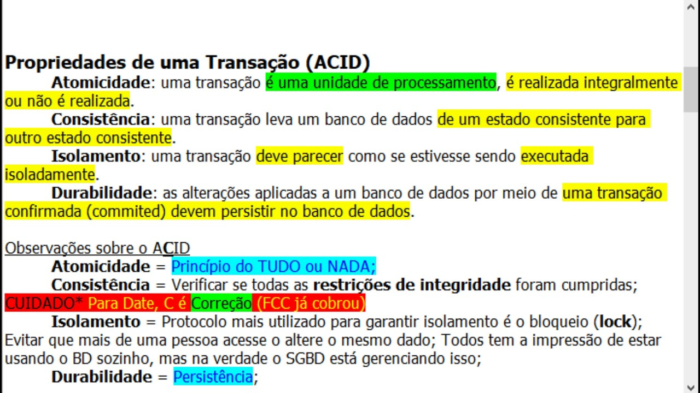

## [Banco de Dados](https://www.oracle.com/database/what-is-a-relational-database/)

Um banco de dados relacional é um tipo de banco de dados que armazena e fornece acesso a pontos de dados relacionados entre si. Os bancos de dados relacionais são baseados no modelo relacional, uma maneira intuitiva e direta de representar dados em tabelas. Em um banco de dados relacional, cada linha da tabela é um registro com um ID exclusivo chamado chave. As colunas da tabela contêm atributos dos dados, e cada registro geralmente possui um valor para cada atributo, facilitando o estabelecimento de relacionamentos entre os pontos de dados.

### O que é um banco de dados relacional? Quando usar?

* Os dados forem estruturados e consistentes (ex: registros de clientes, vendas, produtos).
* For necessário garantir integridade referencial (ex: relacionamento entre pedidos e clientes).
* Transações complexas e ACID (Atomicidade, Consistência, Isolamento, Durabilidade) forem exigidas.
* For necessário realizar consultas complexas com base nos relacionamentos entre os dados (ex: relatórios financeiros, análises de vendas).

---

#### ACID - O que é e como funciona?

Claro! Aqui vai uma explicação **direta** e baseada no link da Oracle sobre ACID:

---

### ✅ ACID – Propriedades de uma transação no banco de dados relacional

1. **Atomicidade**:
   Tudo ou nada. A transação é executada por completo ou desfeita.

2. **Consistência**:
   Garante que as regras do banco sejam sempre respeitadas.

3. **Isolamento**:
   Transações paralelas não se interferem.

4. **Durabilidade**:
   Depois de confirmada, a transação não é perdida, mesmo com queda de energia.

