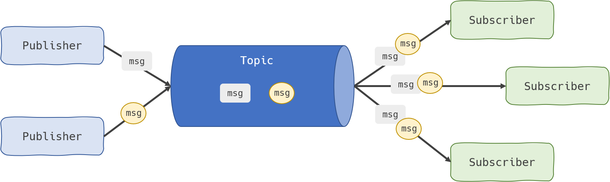

## Mensageria

### O que é mensageria?

Mensageria é um padrão de comunicação entre sistemas que permite a troca assíncrona de mensagens, desacoplando produtores e consumidores. Facilita a escalabilidade, resiliência e flexibilidade na integração de aplicações. É um dos pilares de sistemas autônomos e reativos, sendo caracterizada por:

1. Responsividade
2. Elasticidade
3. Resiliência
4. Orientação a mensagens/eventos

---

### Principais conceitos de mensageria

Os sistemas de mensageria funcionam basicamente com três componentes principais:

- **Produtor:** Componente que envia mensagens para a fila ou tópico.
- **Consumidor:** Componente que recebe e processa mensagens da fila ou tópico.
- **Tópico/Fila:** Canal de comunicação onde mensagens são publicadas e consumidas. Permite múltiplos consumidores.

Além disso, há padrões como *publish/subscribe* (publicação/assinatura), onde múltiplos consumidores podem receber a mesma mensagem, e *point-to-point* (ponto a ponto), onde cada mensagem é consumida por apenas um consumidor.

Exemplo:
No Kafka, temos produtores publicando mensagens em tópicos, consumidores lendo desses tópicos e o broker intermediando a comunicação.
