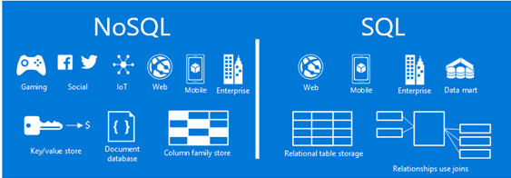
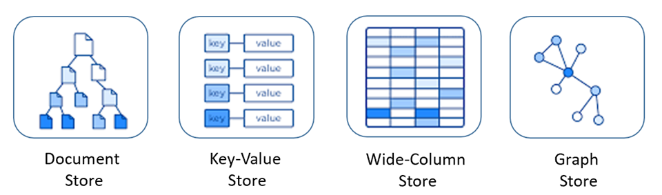

### [O que é um banco de dados não relacional? Quando usar?](https://www.ibm.com/br-pt/think/topics/nosql-databases)

Segundo a IBM, um banco de dados não relacional (NoSQL) é um tipo de banco de dados que não armazena dados em tabelas tradicionais com linhas e colunas, como fazem os bancos de dados relacionais. Em vez disso, ele usa modelos de dados flexíveis, que são mais adequados para tipos de dados diversos e dinâmicos, como documentos, grafos, colunas largas ou pares chave-valor.

### Quando usar um banco de dados não relacional?

* Os dados são semi-estruturados ou não estruturados.
* É necessário um modelo de dados que muda rapidamente.

* Deseja-se uma análise leve, de baixa latência, integrada ao banco de dados operacional.
* É preciso de visualizações em tempo real dos negócios, mesmo que os dados estejam em silos.
* Desenvolve-se aplicativos que precisam armazenar grandes quantidades de dados com diferentes tipos, como dados estruturados, não estruturados e polimórficos.
* É necessário escalar horizontalmente para lidar com grandes volumes de dados e alta taxa de transferência.

Com base no artigo da IBM sobre bancos de dados NoSQL ([fonte oficial da IBM](https://www.ibm.com/br-pt/think/topics/nosql-databases)), aqui está uma **comparação descritiva** entre bancos de dados **relacionais (SQL)** e **não relacionais (NoSQL)**:

### 📦 Banco de Dados Não Relacional (NoSQL)

Bancos de dados não relacionais foram projetados para lidar com **dados variados, grandes volumes e mudanças rápidas de estrutura**. Eles **não utilizam tabelas**, e sim modelos alternativos, como:

- **Documentos** (ex: JSON no MongoDB)
- **Pares chave-valor** (ex: Redis)
- **Grafos** (ex: Neo4j)
- **Colunas** (ex: Cassandra)

O principal diferencial desses bancos é permitir um **esquema flexível ou inexistente**, ou seja, cada registro pode ter um formato diferente. Isso é útil em aplicações modernas, onde os dados mudam com frequência, como em redes sociais, sistemas de recomendação ou IoT.

Em vez de SQL, utilizam **APIs específicas** ou linguagens de consulta próprias para cada tipo de banco. Além disso, priorizam a **escalabilidade horizontal**, o que significa que podem ser facilmente distribuídos entre vários servidores — ideal para grandes volumes de acesso e dados.

Nem sempre seguem as regras rígidas de transações ACID, optando por modelos como **consistência eventual**, onde os dados são sincronizados com o tempo, mas não necessariamente de forma imediata.

---

### ✔ Em resumo:

- Bancos **relacionais (SQL)** são excelentes quando você precisa de estrutura rigorosa, consistência total e transações confiáveis.
- Bancos **não relacionais (NoSQL)** brilham quando você precisa de **flexibilidade, performance e escalabilidade em larga escala**, mesmo que isso signifique abrir mão de algumas garantias imediatas de consistência.

Se quiser, posso montar um exemplo prático de um modelo de dados relacional vs. não relacional. Deseja isso?

