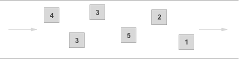

## Filas

### [Tipos de Filas aws](https://docs.aws.amazon.com/AWSSimpleQueueService/latest/SQSDeveloperGuide/sqs-queue-types.html)

#### Fila Padrão (Standard)

- **Alta taxa de transferência:** Suporta grande volume de mensagens por segundo.
- **Entrega pelo menos uma vez:** Pode haver duplicidade, exige idempotência no processamento.
- **Ordenação de melhor esforço:** Não garante ordem de chegada.
- **Alta durabilidade:** Mensagens replicadas em múltiplas zonas.
- **Tempo de visibilidade configurável:** Controla quando a mensagem pode ser reprocessada.

**Quando usar?**

- Processamento assíncrono de grandes volumes.
- Distribuição de tarefas entre múltiplos workers.
- Processamento em lote sem necessidade de ordem.

#### Fila FIFO

- **Ordem garantida:** Mensagens processadas na ordem de envio dentro de grupos.
- **Processamento único:** Sem duplicidade, com deduplicação automática.
- **Rendimento controlado:** Até 3.000 mensagens/s em lote, 300/s individual.

**Quando usar?**
- Ordem dos eventos é essencial (ex: comandos sequenciais, atualização de preços, matrícula em etapas).
